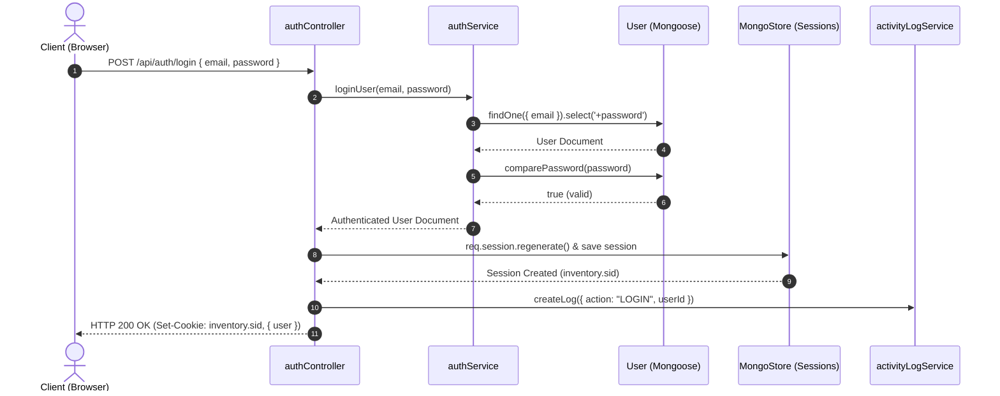
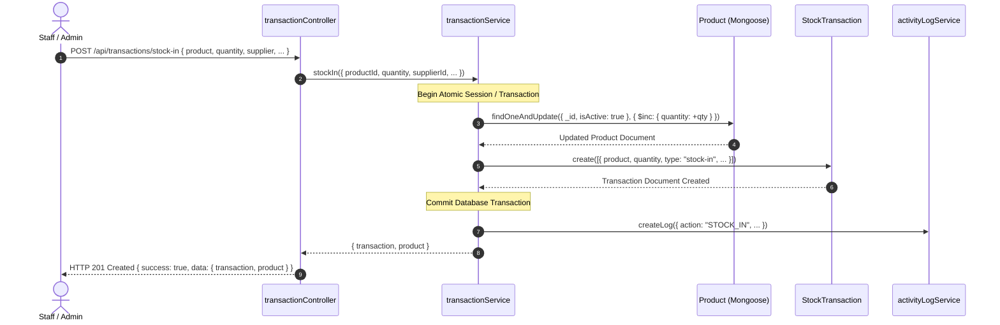
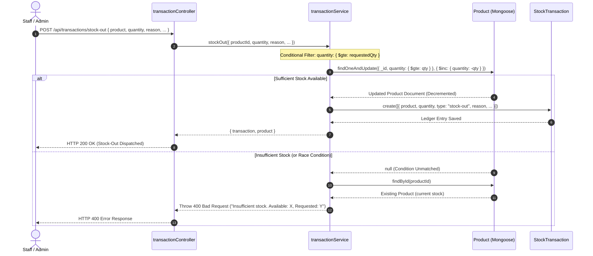

# UML Sequence Diagrams

## 1. Authentication & Session Flow

```mermaid
sequenceDiagram
    autonumber
    actor User as Client (Browser)
    participant AuthCtrl as authController
    participant AuthSvc as authService
    participant UserModel as User (Mongoose)
    participant SessionStore as MongoStore (Sessions)
    participant AuditSvc as activityLogService

    User->>AuthCtrl: POST /api/auth/login { email, password }
    AuthCtrl->>AuthSvc: loginUser(email, password)
    AuthSvc->>UserModel: findOne({ email }).select('+password')
    UserModel-->>AuthSvc: User Document
    AuthSvc->>UserModel: comparePassword(password)
    UserModel-->>AuthSvc: true (valid)
    AuthSvc-->>AuthCtrl: Authenticated User Document
    AuthCtrl->>SessionStore: req.session.regenerate() & save session
    SessionStore-->>AuthCtrl: Session Created (inventory.sid)
    AuthCtrl->>AuditSvc: createLog({ action: "LOGIN", userId })
    AuthCtrl-->>User: HTTP 200 OK (Set-Cookie: inventory.sid, { user })
```

---

## 2. Stock-In Receiving Workflow (Atomic Transaction)

```mermaid
sequenceDiagram
    autonumber
    actor Staff as Staff / Admin
    participant TxnCtrl as transactionController
    participant TxnSvc as transactionService
    participant ProductModel as Product (Mongoose)
    participant TxnModel as StockTransaction
    participant AuditSvc as activityLogService

    Staff->>TxnCtrl: POST /api/transactions/stock-in { product, quantity, supplier, ... }
    TxnCtrl->>TxnSvc: stockIn({ productId, quantity, supplierId, ... })
    Note over TxnSvc: Begin Atomic Session / Transaction
    TxnSvc->>ProductModel: findOneAndUpdate({ _id, isActive: true }, { $inc: { quantity: +qty } })
    ProductModel-->>TxnSvc: Updated Product Document
    TxnSvc->>TxnModel: create([{ product, quantity, type: "stock-in", ... }])
    TxnModel-->>TxnSvc: Transaction Document Created
    Note over TxnSvc: Commit Database Transaction
    TxnSvc->>AuditSvc: createLog({ action: "STOCK_IN", ... })
    TxnSvc-->>TxnCtrl: { transaction, product }
    TxnCtrl-->>Staff: HTTP 201 Created { success: true, data: { transaction, product } }
```

---

## 3. Stock-Out Workflow (with Insufficient Stock Protection)

```mermaid
sequenceDiagram
    autonumber
    actor Staff as Staff / Admin
    participant TxnCtrl as transactionController
    participant TxnSvc as transactionService
    participant ProductModel as Product (Mongoose)
    participant TxnModel as StockTransaction

    Staff->>TxnCtrl: POST /api/transactions/stock-out { product, quantity, reason, ... }
    TxnCtrl->>TxnSvc: stockOut({ productId, quantity, reason, ... })
    Note over TxnSvc: Conditional Filter: quantity: { $gte: requestedQty }
    TxnSvc->>ProductModel: findOneAndUpdate({ _id, quantity: { $gte: qty } }, { $inc: { quantity: -qty } })

    alt Sufficient Stock Available
        ProductModel-->>TxnSvc: Updated Product Document (Decremented)
        TxnSvc->>TxnModel: create([{ product, quantity, type: "stock-out", reason, ... }])
        TxnModel-->>TxnSvc: Ledger Entry Saved
        TxnSvc-->>TxnCtrl: { transaction, product }
        TxnCtrl-->>Staff: HTTP 200 OK (Stock-Out Dispatched)
    else Insufficient Stock (or Race Condition)
        ProductModel-->>TxnSvc: null (Condition Unmatched)
        TxnSvc->>ProductModel: findById(productId)
        ProductModel-->>TxnSvc: Existing Product (current stock)
        TxnSvc-->>TxnCtrl: Throw 400 Bad Request ("Insufficient stock. Available: X, Requested: Y")
        TxnCtrl-->>Staff: HTTP 400 Error Response
    end
```
